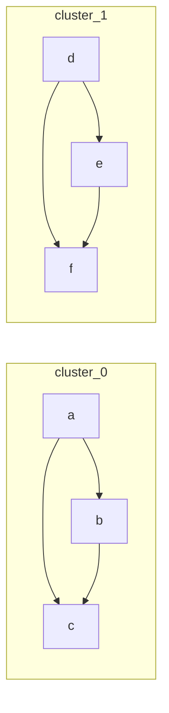
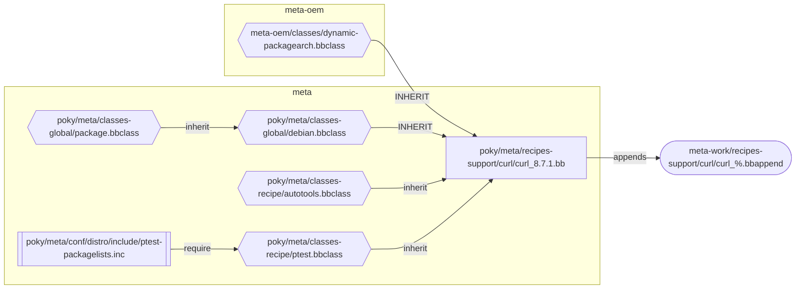

# deptangle


Tools to interrogate and detangle dependency graphs

## Table of contents

* [depconv](#depconv) - convert dependency graphs between formats
* [depfilter](#depfilter) - filter or select subsets of dependency graphs
* [deptransform](#deptransform) - transform dependency graphs
* [depquery](#depquery) - query properties of dependency graphs
* [depcluster](#depcluster) - cluster dependency graphs using community detection
* [graphdiff](#graphdiff) - compare two dependency graphs
* [minpath](#minpath) - shorten file paths to minimal unique suffixes
* [bbclasses](#bbclasses) - generate BitBake recipe inheritance diagrams

# Philosophy

Rather than build an infinitely flexible, does-everything-and-more graph toolkit, these are targeted
tools to solve specific dependency graph problems I frequently encounter.

All tools operate on stdin/stdout in addition to files, and are designed to be chained together with
pipes. Any ancillary output is emitted on stderr.

# How to use

You can install the tools with

```sh
./install --prefix ~/.local/
./install --uninstall --prefix ~/.local/
```

You can also just experiment with the tools by

```sh
cargo run --release --bin depconv -- ...
```

You likely want a release build for large graphs.

# Tools

## depconv

Convert dependency graphs between formats. Input and output formats are auto-detected from file
extensions or by probing the file content when `--input-format`/`--output-format` are not specified.
Defaults to DOT output when no output format can be inferred.

```sh
$ echo -e "a Node A\nb Node B\n#\na b depends on" | depconv --output-format dot
digraph {
    a [label="Node A"];
    b [label="Node B"];
    a -> b [label="depends on"];
}

$ cargo tree --depth 1 | depconv --output-format tgf
deptangle v0.1.0
clap v4.6.6
...
#
deptangle v0.1.0 clap v4.6.6
...
```

### Supported formats

| Format         | `--input-format` | `--output-format` | Description                                                                     |
| -------------- | :--------------: | :---------------: | ------------------------------------------------------------------------------- |
| DOT (GraphViz) |       yes        |        yes        | `digraph` / `graph` syntax. Parses cmake, ninja, bitbake, and ad-hoc DOT output |
| Mermaid        |       yes        |        yes        | `flowchart` / `graph` graph types                                               |
| TGF            |       yes        |        yes        | Trivial Graph Format                                                            |
| Depfile        |       yes        |        yes        | Makefile `.d` depfile                                                           |
| Tree           |       yes        |        yes        | `tree` CLI output, both ascii and unicode output formats                        |
| Pathlist       |       yes        |        yes        | One path per line; hierarchy inferred from `/` separators                       |
| Cargo tree     |       yes        |        no         | `cargo tree` output                                                             |
| Cargo metadata |       yes        |        no         | `cargo metadata --format-version=1` JSON                                        |

### What's preserved across formats

Not every format can represent the same information. The table below shows what each format
preserves when parsing (P) and emitting (E):

| Format         | Labels | Node type |  Attrs  | Edge labels | Subgraphs |
| -------------- | :----: | :-------: | :-----: | :---------: | :-------: |
| DOT            |  P+E   |    P+E    |   P+E   |     P+E     |    P+E    |
| Mermaid        |  P+E   |  partial  | partial |     P+E     |    P+E    |
| TGF            |  P+E   |    --     |   --    |     P+E     |    --     |
| Depfile        |   --   |    --     |   --    |     --      |    --     |
| Tree           |  P+E   |    --     |   --    |     --      |    --     |
| Pathlist       |  P+E   |    --     |   --    |     --      |    --     |
| Cargo tree     |   P    |     P     |    P    |     --      |    --     |
| Cargo metadata |   P    |     P     |    P    |     --      |    --     |

Converting from a rich format (DOT, cargo metadata) to a simpler one (TGF, depfile) silently drops
unsupported attributes. Converting in the other direction preserves graph topology but cannot
recover lost metadata.

## depfilter

Filter or select subsets of dependency graphs. Works on the same graph formats as `depconv`, and is
designed to be chained with pipes.

* `depfilter select` keeps nodes matching `--include` patterns and/or removes `--exclude` patterns
* `depfilter between` select nodes connecting multiple sets of query nodes
* `depfilter cycles` select any cycles in the graph
* `depfilter slice` cut edges between subgraphs, isolating each subgraph

Each subcommand has extra options to tune its behavior.

```sh
# From a cargo dependency tree, select the subtree rooted at "clap", excluding all the proc-macro crates:
$ cargo tree --depth 10 \
    | depfilter select -g "clap*" --deps -x "*derive*" -x "*proc*" -I cargo-tree -O dot
digraph {
    clap [label="v4.6.6 clap"];
    clap_builder [label="v4.6.6 clap_builder"];
    anstream [label="v0.6.21 anstream"];
    ...
}
```

## deptransform

Structural transformations on dependency graphs. Works on the same formats as `depconv`, and is
designed to be chained with pipes.

The `deptransform` tool supports the following subcommands:

* `deptransform reverse` - reverse the direction of all edges in the graph
* `deptransform simplify` - remove redundant edges (e.g. if A->B and B->C, then A->C is redundant)
* `deptransform shorten` - shorten node IDs that look like paths (`minpath`, but for node IDs)
* `deptransform sub` - `sed`, but for node IDs and node / edge attributes
* `deptransform merge` - merge multiple graphs into one
* `deptransform flatten` - recursively flatten subgraphs into the parent graph

```sh
# Collapse bitbake task-level nodes IDs (acl-native.do_* -> acl-native), then remove the
# now-misleading node labels
$ cat data/depconv/bitbake.curl.task-depends.dot |
    deptransform sub --key=id 's/\.do_.*//' |
    deptransform sub --key=node:label 's/.*//'
```

## depquery

Query properties of dependency graphs.

```sh
# Show the 5 crates with the most dependencies:
$ cargo metadata --format-version=1 |
    depquery nodes --sort out-degree --limit 5
deptangle-io        12
deptangle-cli       11
deptangle-ops       11
graphrs             11
tracing-subscriber  10
```

The `depquery` tool supports outputting `nodes`, `edges`, and `metrics`. The output is intended to
be machine-readable, and is tab-separated.

## depcluster

Run community detection on a dependency graph to identify clusters of related nodes. Each cluster
becomes a subgraph in the output, with cross-cluster edges at the top level. Supports Louvain
(default), Leiden, and Label Propagation algorithms.

```sh
$ echo -e "a\nb\nc\nd\ne\nf\n#\na b\na c\nb c\nd e\nd f\ne f" |
    depcluster -I tgf -O mermaid
```



## graphdiff

Compare two dependency graphs and report what changed. Nodes are matched by ID, and edges by their
endpoints.

`graphdiff` supports several subcommands:

* `graphdiff annotate` - output the combined graph with changes highlighted (added, removed, changed
  nodes/edges get distinct attributes)
* `graphdiff list` - tab-delimited list of changes (`+` added, `-` removed, `~` changed, `>` moved)
* `graphdiff summary` - tab-delimited counts of each change type
* `graphdiff subtract` - set difference: nodes and edges only in the first graph

```sh
$ cat before.tgf
a Alpha
b Bravo
#
a b

$ cat after.tgf
b Bravo
c Charlie
#
b c

$ graphdiff annotate before.tgf after.tgf -O mermaid
```


## minpath

Shorten file paths to the minimal unique suffix. Useful for displaying lists of files in a compact
way while keeping them distinguishable.

```sh
$ minpath <<EOF
/home/user/project/src/main.rs
/home/user/project/src/lib.rs
/home/user/project/tests/main.rs
EOF

src/main.rs
lib.rs
tests/main.rs
```

Multiple options are available to customize and tune the output. See `minpath --help` for details.

## bbclasses

The [bbclasses](./scripts/bbclasses) script can parse BitBake recipes to generate an inheritance
diagram. It tries to evaluate variable expansion, and needs to run in your BitBake environment to
work properly.

```sh
bbclasses --group-by-layer curl >curl.dot
```


